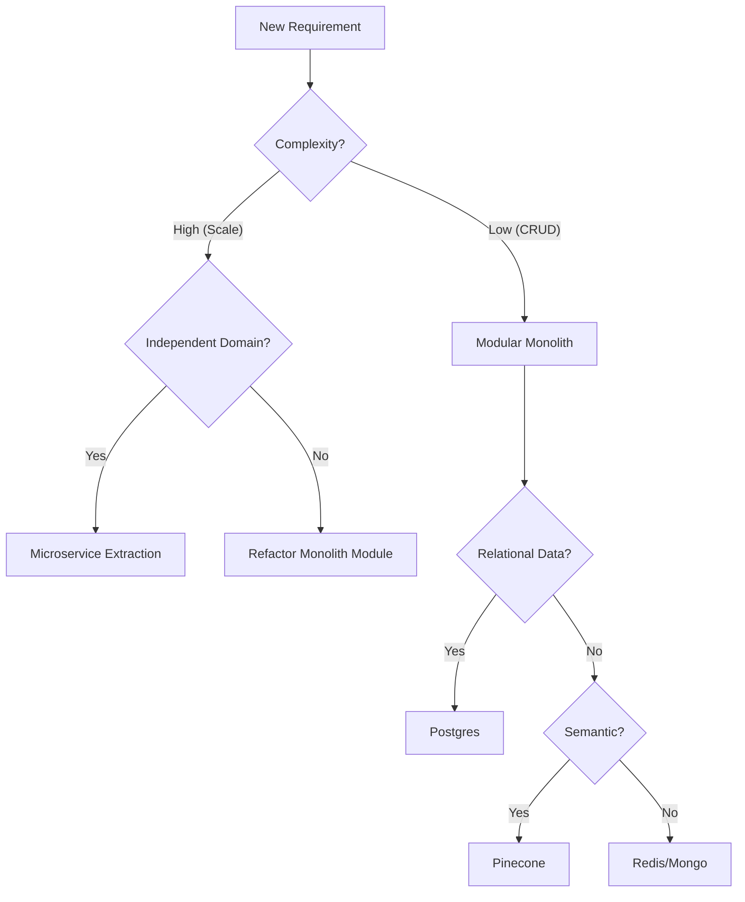
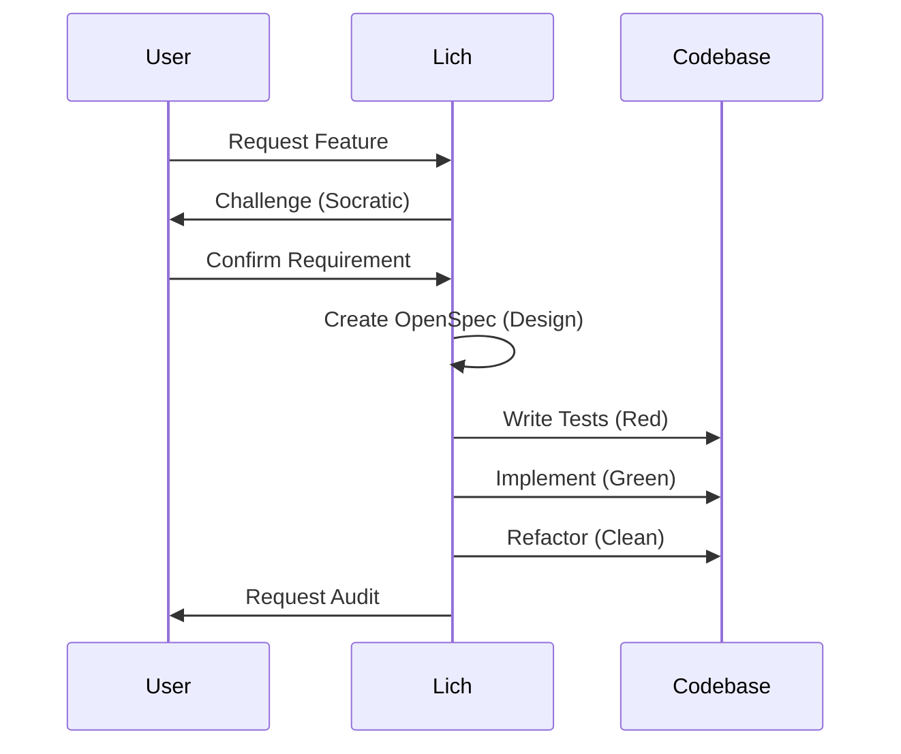

# Rule 09: Visual Logic (The Map)

**"A  picture is worth 1000 tokens."**

---

## 1. The Architectural Decision Tree

```mermaid
graph TD
    Start[New Requirement] --> Complexity{Complexity?}
    
    Complexity -- Low (CRUD) --> Pattern[Modular Monolith]
    Complexity -- High (Scale) --> DomainCheck{Independent Domain?}
    
    DomainCheck -- Yes --> Microservice[Microservice Extraction]
    DomainCheck -- No --> Refactor[Refactor Monolith Module]
    
    Pattern --> DB{Relational Data?}
    DB -- Yes --> SQL[Postgres]
    DB -- No --> Vector{Semantic?}
    
    Vector -- Yes --> Pinecone
    Vector -- No --> NoSQL[Redis/Mongo]
```

## 2. The Development Loop

```mermaid
sequenceDiagram
    participant User
    participant Lich
    participant Codebase
    
    User->>Lich: Request Feature
    Lich->>User: Challenge (Socratic)
    User->>Lich: Confirm Requirement
    Lich->>Lich: Create OpenSpec (Design)
    Lich->>Codebase: Write Tests (Red)
    Lich->>Codebase: Implement (Green)
    Lich->>Codebase: Refactor (Clean)
    Lich->>User: Request Audit
```
