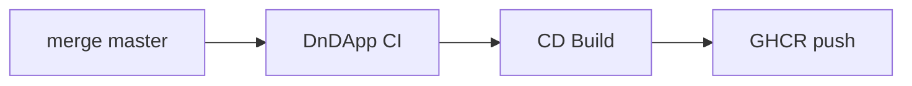

# GHCR packages — DnDApp

**Registry:** [GitHub Container Registry](https://ghcr.io)  
**Owner:** `crozzbite`  
**Visibility:** **Private** (required — never public)  
**Source repo:** [crozzbite/DnDApp](https://github.com/crozzbite/DnDApp)

Copy sections below into each package’s **README** on GitHub (Package → Settings → Description / README) if the UI still shows generic auto text.

---

## Package: `dndapp-api`

| Field | Value |
|-------|--------|
| Image | `ghcr.io/crozzbite/dndapp-api:<git-sha-short>` |
| Dockerfile | `deploy/docker/backend.Dockerfile` |
| Runtime | Node 22 alpine (NestJS + Fastify) |
| Build stage | bun 1.3.9 alpine |
| Exposed port | `3000` |
| Health | `GET /health` (liveness), `GET /ready` (Redis readiness) |
| API prefix | `/v1` |

### What it is

Backend **Nexus Gateway** for DnDApp: compendium search, BullMQ workers, Redis-backed queues. Stateless HTTP pods; Redis holds queue state.

### Tags

| Tag pattern | Source | Use |
|-------------|--------|-----|
| `<short-sha>` e.g. `de48622` | CD Build on `master` | Deploy to K8s (`Build-Overlay -ImageTag`) |
| `@sha256:…` | GHCR digest | Immutable pin (recommended for prod) |

**No `:latest`** in automated CI — only SHA tags.

### Pull (cluster)

Requires `imagePullSecrets: ghcr-pull` in each namespace (see [COMMAND-REFERENCE §16f](./COMMAND-REFERENCE.md#16f-private-package--cluster-needs-a-pull-secret)).

### Traceability

OCI label on image:

```text
org.opencontainers.image.source=https://github.com/crozzbite/DnDApp
```

### Local run (dev)

```powershell
cd backend
bun install
bun run start:dev
# Swagger (non-prod only): http://localhost:3000/docs
```

---

## Package: `dndapp-web`

| Field | Value |
|-------|--------|
| Image | `ghcr.io/crozzbite/dndapp-web:<git-sha-short>` |
| Dockerfile | `deploy/docker/frontend.Dockerfile` |
| Runtime | Node 22 alpine (Angular 19 SSR) |
| Build | `npm ci` + `npm run build` |
| SSR command | `node dist/DnDApp/server/server.mjs` |
| Probe | `GET /health` on port 4000 |

### What it is

Frontend **Flesh layer**: Angular 19 standalone + SSR. Serves the D&D compendium UI; talks to the API via ingress routing (`/v1` → api service).

### Tags

Same convention as `dndapp-api` — **always promote the same SHA** for api + web together.

### Pull (cluster)

Same `ghcr-pull` secret as API.

### Traceability

Same OCI `org.opencontainers.image.source` label as API.

### Local run (dev)

```powershell
cd frontend
npm ci
npm run start
```

---

## CI/CD supply chain (how images get here)



| Workflow | Pushes |
|----------|--------|
| `dndapp-cd-build.yml` | Both packages after green CI |
| Manual Phase 2 | `docker push` with local `gh auth token` |

**Actions access:** each package needs **Manage Actions access → DnDApp → Write** (not just repo link).

Full diagrams: [COMMAND-REFERENCE §0](./COMMAND-REFERENCE.md#0-visual-maps-high-signal).

---

## Security notes

- Packages remain **Private** — public repo ≠ public images.
- Do not embed tokens, kubeconfig, or `.env` in layers (`.dockerignore` enforced).
- GitHub Actions uses `GITHUB_TOKEN` for push; deploy uses Azure OIDC — no long-lived registry PAT in CI.
- Report vulnerabilities via repo Issues — do not paste secrets.

---

*Maintained with the DnDApp deployment learning track. Update when Dockerfile or workflow conventions change.*
