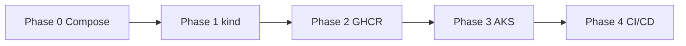
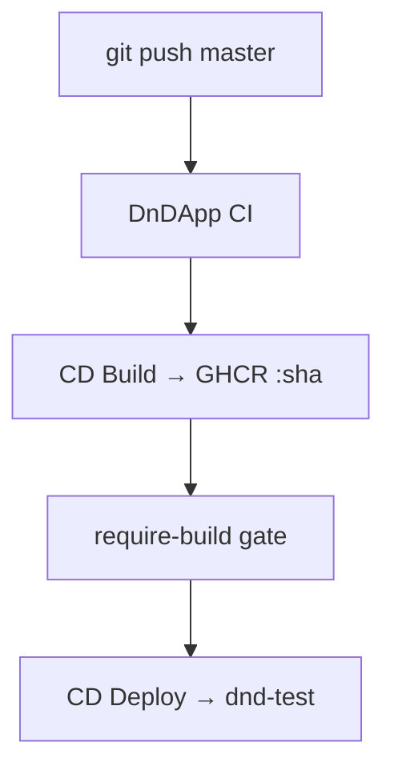
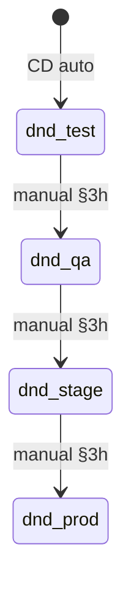

# DnDApp — Deployment command reference

**Parent:** [DEPLOYMENT-MASTER-PLAN.md](./DEPLOYMENT-MASTER-PLAN.md)  
**Purpose:** Day-to-day ops after Phase 4 — CI/CD, AKS, promote, troubleshoot.  
**Shell:** PowerShell on Windows — chain with `;` (not `&&`).

**Local constants (not in git):** copy [deploy/local.env.ps1.example](../deploy/local.env.ps1.example) → `deploy/local.env.ps1`. Sync to GitHub: `.\deploy\scripts\set-github-cicd-vars.ps1`. Standard: [skullrender-cicd-standard.md](./skullrender-cicd-standard.md).

```powershell
Set-Location (git rev-parse --show-toplevel)
. .\deploy\local.env.ps1    # sets $RG, $CLUSTER — your file is gitignored
```

**Learning track (Phases 0–3 manual):** [archive/COMMAND-REFERENCE-phases-0-3-manual.md](./archive/COMMAND-REFERENCE-phases-0-3-manual.md) · [phase-*-checklists](./phase-4-checklist.md)

---

## Quick index

| I need to… | Section |
|------------|---------|
| See the big picture (DAGs) | [§0](#0-visual-maps) |
| Preflight tools / Azure login | [§1](#1-preflight) |
| Deploy / smoke / stop AKS | [§2](#2-aks-operations) |
| CI local mirror, PR, monitor pipeline | [§3](#3-cicd-github-actions) |
| Promote qa → stage → prod | [§3h](#3h-manual-promotion) |
| Fix something broken | [§4](#4-troubleshoot) |
| GHCR package README | [ghcr-packages.md](./ghcr-packages.md) |

---

## 0. Visual maps

### 0a. Learning path (done)



### 0b. CI/CD chain (`master` push)



| Workflow | Trigger | Auth |
|----------|---------|------|
| `dndapp-ci.yml` | PR + push `master` | none |
| `dndapp-cd-build.yml` | after green CI | `GITHUB_TOKEN` |
| `dndapp-cd-deploy.yml` | after green CD Build | Azure OIDC (`AZURE_*`) |

### 0c. Promotion



| Namespace | Host | Who deploys |
|-----------|------|-------------|
| `dnd-test` | `dnd-test.local` | GitHub Actions |
| `dnd-qa` / `stage` / `prod` | `dnd-*.local` | You (`Build-Overlay -ImageTag`) |

Same **image SHA** everywhere; ConfigMap differs per namespace.

> 🚨 Cerbero: GHCR packages **Private**. Docs use secret **names** only — never paste values.

---

## 1. Preflight

```powershell
docker info --format "{{.ServerVersion}}"
kubectl config current-context    # expect $DndKubectlContext from local.env.ps1
az account show -o table          # az login if needed
git branch --show-current         # master
gh auth status                    # repo, workflow, write:packages
```

| Pin | Where |
|-----|--------|
| Node **22** | frontend CI + Dockerfiles |
| bun **1.3.9** | backend CI + `packageManager` |

---

## 2. AKS operations

**Cluster / RG:** from `local.env.ps1` · **Context:** `kubectl config use-context $DndKubectlContext`

### Start / stop (cost)

```powershell
az aks start  --resource-group $RG --name $CLUSTER
az aks stop   --resource-group $RG --name $CLUSTER
az aks show -g $RG -n $CLUSTER --query powerState.code -o tsv
```

CD Deploy auto-starts the cluster if Stopped (may take ~12 min).

### Deploy with Build-Overlay

```powershell
Set-Location (git rev-parse --show-toplevel)
. .\deploy\local.env.ps1
$tag = git rev-parse --short HEAD

# Preview
.\deploy\k8s\scripts\Build-Overlay.ps1 -Environment test -ImageTag $tag

# Apply one env
.\deploy\k8s\scripts\Build-Overlay.ps1 -Environment test -ImageTag $tag -Apply

# Apply all five
.\deploy\k8s\scripts\Build-Overlay.ps1 -Environment all -ImageTag $tag -Apply

kubectl rollout status deployment/api -n dnd-test
kubectl get deploy -A -l app.kubernetes.io/part-of=dndapp `
  -o custom-columns='NS:.metadata.namespace,IMAGE:.spec.template.spec.containers[0].image'
```

**Typo traps:** `-Environment` (not `-Enviroment`); `kubectl` (not `cubectl`).

### GHCR pull secret (once per namespace, or after token expiry)

```powershell
$ghUser = gh api user -q .login   # your GitHub login — never hardcode in docs
$namespaces = @("dnd-dev", "dnd-test", "dnd-qa", "dnd-stage", "dnd-prod")
foreach ($ns in $namespaces) {
  kubectl create secret docker-registry ghcr-pull `
    --docker-server=ghcr.io --docker-username=$ghUser `
    --docker-password="$(gh auth token)" -n $ns `
    --dry-run=client -o yaml | kubectl apply -f -
}
```

> Token stays in `gh` credential store — **never** commit it. `$(gh auth token)` at runtime is correct.

### Ingress smoke (hosts file)

```powershell
$ip = kubectl get svc -n ingress-nginx ingress-nginx-controller `
  -o jsonpath='{.status.loadBalancer.ingress[0].ip}'
Write-Host "EXTERNAL-IP: $ip"
```

Add **all five hosts** on one line in `C:\Windows\System32\drivers\etc\hosts` (Administrator Notepad):

```text
<IP>  dnd-dev.local dnd-test.local dnd-qa.local dnd-stage.local dnd-prod.local
```

```powershell
curl.exe http://dnd-test.local/ready
curl.exe http://dnd-test.local/health
```

**Bootstrap cluster from scratch:** [archive §17](./archive/COMMAND-REFERENCE-phases-0-3-manual.md) · [phase-3-checklist.md](./phase-3-checklist.md)

---

## 3. CI/CD (GitHub Actions)

**Branch:** `master` · **Diagrams:** [§0](#0-visual-maps)

### 3a. Local preflight (mirror CI)

```powershell
cd backend ; bun install ; bun run lint ; bun run test ; bun run build
cd ..\frontend ; npm ci ; npm run build
```

### 3b. PR + merge

```powershell
git checkout -b feat/my-change
git push -u origin feat/my-change
gh pr create --base master --title "feat: ..." --body "..."
gh pr merge <N> --squash
git switch master ; git pull origin master
```

OneDrive lock on checkout? `git reset --hard HEAD` then retry switch.

### 3c. Monitor pipeline

```powershell
gh run list --limit 8
gh run list --workflow "DnDApp CI" --limit 3
gh run list --workflow "DnDApp CD Build" --limit 3
gh run list --workflow "DnDApp CD Deploy" --limit 3
gh run watch <RUN_ID> --exit-status
gh run view <RUN_ID> --log-failed
```

Push to `master` runs: **CI → CD Build → CD Deploy → dnd-test** (no manual step).

### 3d. CD Build (GHCR)

- Workflow: `dndapp-cd-build.yml`
- Pushes `ghcr.io/<owner>/dndapp-api:<sha>` + `dndapp-web:<sha>` (owner = your GitHub user)
- Requires **Manage Actions access → Write** on both GHCR packages

### 3e. CD Deploy (OIDC → dnd-test)

**One-time bootstrap** (local `az login`):

```powershell
.\deploy\scripts\bootstrap-github-oidc.ps1 -SetGitHubSecrets
# optional least-privilege K8s RBAC:
.\deploy\scripts\bootstrap-github-oidc.ps1 -SetGitHubSecrets -ApplyK8sRbac
```

Secrets set (names only): `AZURE_CLIENT_ID`, `AZURE_TENANT_ID`, `AZURE_SUBSCRIPTION_ID`.

**Manual deploy same tag as CI:**

```powershell
. .\deploy\local.env.ps1
kubectl config use-context $DndKubectlContext
$tag = git rev-parse --short HEAD
.\deploy\k8s\scripts\Build-Overlay.ps1 -Environment test -ImageTag $tag -Apply
```

### 3h. Manual promotion

Only `dnd-test` is automated. Promote **same SHA** — no rebuild.

```powershell
$tag = "de48622"   # SHA validated in test
foreach ($env in @("qa", "stage", "prod")) {
  .\deploy\k8s\scripts\Build-Overlay.ps1 -Environment $env -ImageTag $tag -Apply
  kubectl rollout status deployment/api -n "dnd-$env"
  kubectl rollout status deployment/web -n "dnd-$env"
}
curl.exe http://dnd-prod.local/ready
```

---

## 4. Troubleshoot

| Symptom | Fix |
|---------|-----|
| CI run **cancelled** (X) | Newer push won — check **latest** run |
| `ImagePullBackOff` | Recreate `ghcr-pull` secret (§2) |
| `Could not resolve host` | Add all 5 `*.local` to hosts file |
| Deploy workflow waits forever | AKS Stopped — wait for auto-start or `az aks start` |
| CORS errors | Fix `FRONTEND_URL` in `deploy/k8s/config/environments.json` + re-apply overlay |
| Wrong cluster | `kubectl config current-context` → must match `$DndKubectlContext` |
| `bun install --frozen-lockfile` fails | `bun install` locally, commit `bun.lock` |
| `npm ci` fails | Regenerate `package-lock.json`, commit |
| gga / OneDrive checkout fail | `git reset --hard HEAD`; exclude huge files from review |
| GHCR push 403 | Package → Manage Actions access → DnDApp → Write |

More rows (AKS create, kind, compose): [archive troubleshoot](./archive/COMMAND-REFERENCE-phases-0-3-manual.md).

---

## Cheat sheet

| Pattern | Tool | Meaning |
|---------|------|---------|
| `Build-Overlay.ps1 -Environment test -ImageTag $tag -Apply` | PowerShell | Deploy env with SHA tag |
| `kubectl rollout status deployment/api -n dnd-test` | kubectl | Wait for rollout |
| `gh run watch <ID>` | gh | Watch Actions run |
| `gh pr create --base master` | gh | PR to correct default branch |
| `az aks stop/start` | az | Cost control |
| `bun install --frozen-lockfile` | bun | CI-parity install |
| `ghcr.io/<owner>/dndapp-api:<sha>` | GHCR | Image naming convention |

---

*Operational runbook — post Phase 4. Archive holds the full learning-track commands.*
