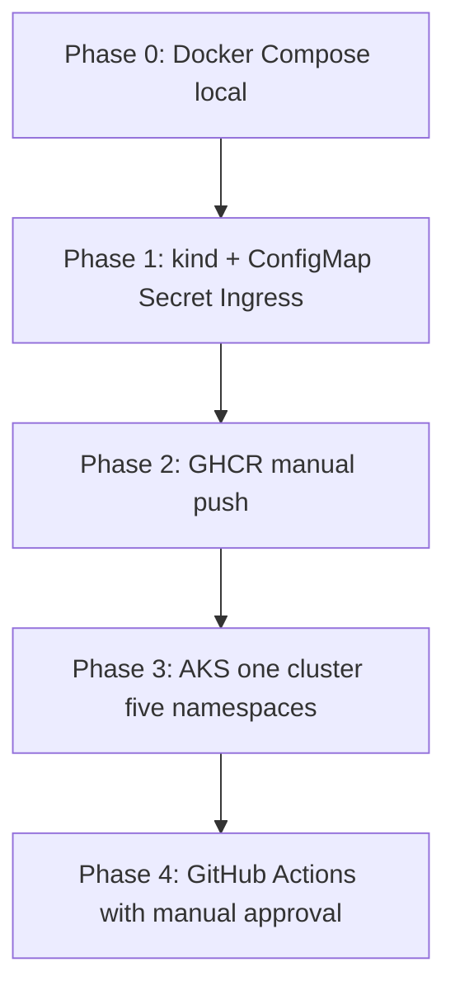

# DnDApp — Enterprise Deployment Master Plan

**Status:** Active reference for manual → automated delivery  
**Created:** 2026-05-20  
**Repo:** https://github.com/crozzbite/DnDApp (public)  
**Production frontend (legacy):** https://dnd-5e-saas.vercel.app/

This document captures decisions from the DevOps learning track. Use it as the single source of truth while executing phases step by step. Implementation artifacts live under `deploy/` (created in Phase 0).

---

## 1. Success criteria (chat goal)

- Learn a **professional manual deployment** (enterprise-style discipline).
- Run a **manual pipeline** first, then **automate** it (CI/CD).
- Support **five promotion stages:** dev → test → QA → stage → production.
- Use **Docker** and **Kubernetes** (Azure AKS when moving to cloud).
- Understand **ConfigMap** vs **Secret** vs environment variables.

---

## 2. Decisions log (frozen until revised)

| Topic | Decision |
|-------|----------|
| What to deploy | **Frontend** (Angular 19 SSR) + **Backend** (NestJS/Fastify REST) + **Redis** (BullMQ) |
| Auth / Firebase | **Not required** for MVP (no login); Firebase not wired in repo |
| Git | Public repo `crozzbite/DnDApp`; version images with **git SHA** (+ optional semver tags) |
| Container registry | **GHCR** first (`ghcr.io/crozzbite/...`); Azure ACR when AKS is live |
| Azure account | Create when ready; **local/kind before AKS** to control cost |
| Domain | **Vercel free** URL for frontend prod for now; no custom domain yet |
| K8s topology | **One AKS cluster**, **five namespaces** (not five clusters) |
| Config | **ConfigMap** for non-secret config; **Secret** for Redis passwords / API keys |
| State model | **Stateless** API pods; state in **Redis** (and future SQL if added) |
| Hybrid edge | Keep **Vercel frontend** optional during learning; backend targets K8s path |
| Docker image builds | **Backend:** bun (build) → **Node 22** alpine (run). **Frontend:** npm ci (build) → **Node 22** alpine (run). No bun in frontend Dockerfile — bun install unreliable in Docker for Angular SSR |
| Node.js runtime pin | **22** — Dockerfiles (`node:22-alpine`), GitHub Actions frontend job (`setup-node` v22), CI workflow `dndapp-ci.yml` |

---

## 3. Current codebase reality (baseline audit)

| Piece | State |
|-------|--------|
| Frontend | Angular 19 + SSR (`npm run serve:ssr:DnDApp`) |
| Backend | NestJS + Fastify; prefix `v1`; **liveness** `/health`, **readiness** `/ready` (Redis PING) |
| Redis | Required for BullMQ (`REDIS_HOST`, `REDIS_PORT`) |
| Docker / K8s / CI | **Docker + compose + k8s/base** in `deploy/` (Phase 0–1); CI/GHCR in Phase 2+ |
| Firebase | Only mentioned in docs; **no** `firebase.json` in tree |
| Vercel | Referenced in specs; **no** `vercel.json` in local tree |
| OpenSpec deployment spec | `openspec/changes/nexus-build-plan/specs/nexus-deployment/` |

Backend already expects:

- `NODE_ENV`, `PORT`, `FRONTEND_URL` (required in production for CORS)
- `REDIS_HOST`, `REDIS_PORT`

---

## 4. Security prerequisite (do before Phase 0 push)

If `git remote -v` shows a **token embedded in the URL**, revoke it in GitHub and reset the remote:

```powershell
cd path\to\DnDApp
git remote set-url origin https://github.com/crozzbite/DnDApp.git
```

Prefer `gh auth login` or SSH. Never commit PATs.

---

## 5. Environment model (five stages)

| Namespace (planned) | Purpose | Typical deployer |
|---------------------|---------|------------------|
| `dnd-dev` | Fast iteration, broken configs OK | You, manual |
| `dnd-test` | CI smoke after PR merge | GitHub Actions (later) |
| `dnd-qa` | Human UAT, stable-ish data | Manual promotion |
| `dnd-stage` | Pre-prod parity | Manual with gate |
| `dnd-prod` | Live traffic | Manual approval → later automated gate |

**Promotion rule:** same container image digest/tag promoted across namespaces; only **ConfigMap/Secret** values change per stage.

### Subdomains vs paths (when you have a custom domain)

- **Preferred (enterprise):** `dev.app.com`, `api-dev.app.com`, etc.
- **Without paid domain:** Vercel `*.vercel.app` for frontend; K8s uses LoadBalancer IP or `*.cloudapp.azure.com` until DNS exists.

---

## 6. ConfigMap vs Secret vs env

### ConfigMap (non-sensitive)

Examples for DnDApp:

```yaml
API_PORT: "3000"
NODE_ENV: "production"
LOG_LEVEL: "info"
CORS_ORIGINS: "https://dnd-5e-saas.vercel.app"
DND5E_API_URL: "https://www.dnd5eapi.co/api"
OPEN5E_API_URL: "https://api.open5e.com"
```

Use ConfigMap when:

- Many keys or file-shaped config (`appsettings.json`, `feature-flags.json`)
- You want to change config without rebuilding the image (redeploy/reload)

### Secret (sensitive)

```yaml
REDIS_PASSWORD: "..."
# future: API keys, DB connection strings
```

### Environment variables in Deployment

Inject ConfigMap/Secret keys as `env` or mount as files under `/config`. Start with `envFrom: configMapRef` + `secretRef` for clarity.

---

## 7. Target repository layout (created during phases)

```text
deploy/
  docker/
    backend.Dockerfile
    frontend.Dockerfile
  compose/
    docker-compose.yml          # Phase 0: local stack
  k8s/
    base/                       # shared manifests
    overlays/
      dev/
      test/
      qa/
      stage/
      prod/                     # Kustomize patches per namespace
docs/deployment/
  DEPLOYMENT-MASTER-PLAN.md     # this file
  COMMAND-REFERENCE.md          # copy-paste workflows (compose + k8s)
  phase-0-checklist.md          # Phase 0 session steps
  phase-1-checklist.md          # Phase 1 session steps (kind)
```

---

## 8. Learning path (phases)



### Phase 0 — Local manual (COMPLETE)

**Goal:** `docker compose up` → frontend + backend + redis reachable on localhost.

Deliverables:

1. `deploy/docker/backend.Dockerfile` (bun build → node run)
2. `deploy/docker/frontend.Dockerfile` (npm ci → node SSR)
3. `deploy/compose/docker-compose.yml`
4. Example ConfigMaps for local (optional file for compose env)
5. Manual checklist: build → up → health → logs → down (rollback)

**Exit criteria:**

- `GET http://localhost:3000/health` → `status: ok`
- Frontend loads and calls external APIs (dnd5eapi / open5e)
- Redis up; backend workers connect

### Phase 1 — Kubernetes local

**Goal:** Deploy same images to **kind** or **minikube** with ConfigMap + Secret + Service + Ingress.

Tools: `kubectl`, `kustomize`, optional `helm`.

### Phase 2 — Registry manual

**Goal:** Build once, tag with `git rev-parse --short HEAD`, push to GHCR, deploy by digest reference.

### Phase 3 — Azure AKS

**Goal:** One cluster, five namespaces, Ingress + HTTPS (cert-manager when domain exists).

**Cost control:** stop/start cluster or scale node pool to 0 when not practicing.

### Phase 4 — CI/CD

**Goal:** GitHub Actions — build, test, push image; deploy to `dnd-test` automatically; promote to QA/stage/prod with **manual workflow approval**.

---

## 9. Azure “free” expectations

| Service | Notes |
|---------|--------|
| Azure account | Free tier + initial credits OK |
| AKS | **Not free** long-term; nodes + LB cost money |
| ACR | Low cost; optional if using GHCR |
| Recommendation | Phases 0–2 on PC; AKS only after comfortable with kubectl |

---

## 10. Vercel + K8s hybrid (pragmatic)

| Layer | Now | Later |
|-------|-----|-------|
| Frontend prod | Vercel free URL | Optional move to K8s Ingress |
| Backend | Not on Vercel | K8s Deployment + Service |
| Redis | Local container → K8s StatefulSet or Azure Cache | Managed Redis in prod |

Sync Vercel deploy with `master` on GitHub when debugging “stale” production site.

---

## 11. Image versioning convention

```text
ghcr.io/crozzbite/dndapp-api:<git-sha-short>
ghcr.io/crozzbite/dndapp-web:<git-sha-short>
```

Promote **the same SHA** across namespaces. Production may pin `@sha256:...` for immutability.

---

## 12. Open questions (parked)

- [ ] Custom domain provider (Cloudflare vs Azure DNS) when budget allows
- [ ] PostgreSQL / Prisma — not required for Phase 0 (not in running backend yet)
- [ ] Observability stack (Prometheus/Grafana) — Phase 4+

---

## 13. Related specs

- `openspec/changes/nexus-build-plan/specs/nexus-deployment/nexus-deployment.spec.md`
- `openspec/specs/Layer-3-Armor/armor-tech-stack.md` (Hybrid Throne: Edge + Core)

---

## 14. Session handoff

**Phase 3:** ✅ COMPLETE (2026-06-22) — AKS `aks-dndapp`, five namespaces, Ingress smoke.  
**Phase 3.5:** ✅ COMPLETE (2026-06-25) — `/health` vs `/ready`, GHCR digest, AKS smoke ×5, lint/test/build green.  
**Phase 4:** 🔄 IN PROGRESS — **CI v1 ✅** · **CD GHCR ✅** · **CD Deploy OIDC → dnd-test** (Step E, verify first run)  
**Follow:** `docs/deployment/phase-4-checklist.md` · **Commands:** `COMMAND-REFERENCE.md` §18g (deploy OIDC)

---

*Maintained as part of the SkullRender DnDApp deployment learning track. Update this file when a phase completes or decisions change.*
