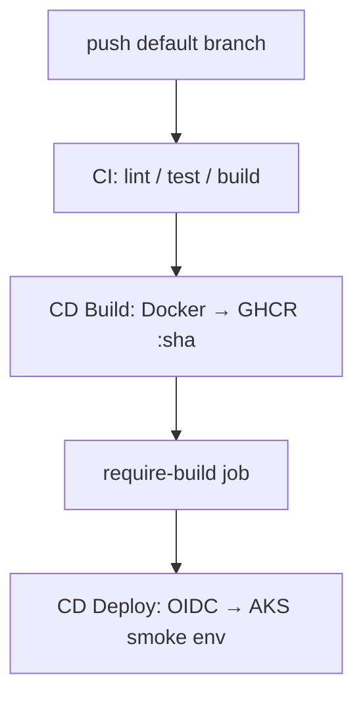

# SkullRender CI/CD standard

> **Canon (normative):** `WorkDesktop/docs/refined-rules/skullrender-cicd-standard.md`  
> Edit canon first; keep this file aligned when the standard changes.  
> **Reference implementation:** this repo (DnDApp Phase 4).

**Purpose:** Reusable pipeline pattern — CI → CD Build (GHCR) → CD Deploy (AKS via OIDC).  
**No operational fingerprints in git:** project values live in GitHub Actions **variables**, **secrets**, and local `deploy/local.env.ps1` (gitignored).

**Operational runbook (this repo only):** [COMMAND-REFERENCE.md](./COMMAND-REFERENCE.md) — not part of SkullRender canon.

---

## Architecture

| Workflow | Trigger | Secrets | Variables |
|----------|---------|---------|-----------|
| `*-ci.yml` | PR + push | none | optional `CD_DEFAULT_BRANCH` |
| `*-cd-build.yml` | after green CI | `GITHUB_TOKEN` | `GHCR_*_PACKAGE` |
| `*-cd-deploy.yml` | after green CD Build | `AZURE_CLIENT_ID`, `AZURE_TENANT_ID`, `AZURE_SUBSCRIPTION_ID` | Azure RG/cluster, deploy env, ingress host |

---

## Three-layer configuration

| Layer | Where | Committed? | Examples |
|-------|--------|------------|----------|
| **Workflow logic** | `.github/workflows/*.yml` | Yes | job steps, SHA pins, gates — uses `${{ vars.* }}` / `${{ github.repository }}` |
| **Project values (cloud)** | GitHub → Settings → Actions → **Variables** | No (stored in GitHub) | `AZURE_RESOURCE_GROUP`, `GHCR_API_PACKAGE` |
| **Project values (local)** | `deploy/local.env.ps1` | **No** (gitignored) | same names for `az` / `kubectl` / bootstrap |
| **Credentials** | GitHub **Secrets** + `gh auth` | Never in git | `AZURE_*`, `$(gh auth token)` at runtime |

**Template:** [deploy/local.env.ps1.example](../deploy/local.env.ps1.example)  
**Sync local → GitHub vars:** `.\deploy\scripts\set-github-cicd-vars.ps1`

---

## Bootstrap a new repo (checklist)

1. Copy workflow trio from DnDApp (`dndapp-ci.yml`, `dndapp-cd-build.yml`, `dndapp-cd-deploy.yml`) — rename per project.
2. Copy `deploy/local.env.ps1.example` → `deploy/local.env.ps1` — fill Azure, GHCR package names, namespace prefix, ingress host.
3. Run `.\deploy\scripts\set-github-cicd-vars.ps1` — pushes variables to GitHub.
4. Create GHCR packages; grant **Manage Actions access → Write** on each package.
5. Run `.\deploy\scripts\bootstrap-github-oidc.ps1 -SetGitHubSecrets [-ApplyK8sRbac]` once.
6. Ensure K8s overlays + `Build-Overlay.ps1` match your namespace prefix and environments.

---

## Conventions (all SkullRender deploy repos)

| Topic | Rule |
|-------|------|
| Image tags | `<git-short-sha>` only in CI — no `:latest` |
| GHCR path | `ghcr.io/${{ github.repository_owner }}/${{ vars.GHCR_API_PACKAGE }}:sha` |
| OCI source label | `${{ github.server_url }}/${{ github.repository }}` at build time |
| Auto deploy | One non-prod namespace only (e.g. `*-test`); prod manual promote |
| Docs in git | Placeholders + `local.env.ps1.example` — never user paths or live RG names |
| Doc-only commits | `[skip ci]` in commit message skips the chain (saves AKS cost) |

---

## This repo

- **Runbook:** [COMMAND-REFERENCE.md](./COMMAND-REFERENCE.md)
- **Phase 4 checklist:** [phase-4-checklist.md](./phase-4-checklist.md)
- **Local config:** `deploy/local.env.ps1` (gitignored) + [local.env.ps1.example](../../deploy/local.env.ps1.example)

---

## Deferred (any repo)

- GitHub `environment:` reviewers for qa/stage/prod
- Custom domain + TLS
- Path filters to skip CI on docs-only (optional; `[skip ci]` is enough)
